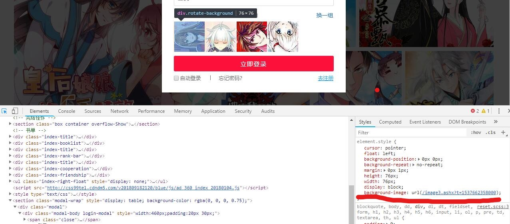

## 破解类似极速漫画网站的验证码

在网站没有找到这种4张图片旋转的验证码爬虫破解方法，于是决定自己写写一个可行的方法，虽然这个方法比较笨拙，但却是有效的。

**我使用的工具是pycharm3.6和谷歌浏览器**

首先打开极速漫画的网页，看看我们需要做好什么，定好计划，然后一步步实现。
基本大的方向有下面几部：
1.模拟浏览器点击右上角的人物头像，弹出登录模态框
2.获取用户名和密码的输入框，自动填写
3通过截图的方式将出现的这4张图片截取下来
4.通过旋转图片，和库中的图片对比，知道转正为止
5.获取登录按钮并点击

ok，大纲拟好，让我们来一步步实现它

因为第四部中提到了‘与库中的图片对比’，那么我们就应该获取它库中的图片，通过审查元素发现，极速漫画的验证码图片在标记位置，让我们访问一下这个地址，


通过访问地址发现，每次刷新这个地址，图片都是不一样的，而且每一张图都有四中不一样的方向，而在网页显示的是每个大图的第一排，如下图
:
    response = requests.get(img_source)
    filename = './imgs/%s.png'% num
    with open(filename, 'wb')as f:
        f.write(response.content)
        
if __name__ == '__main__':
    # 保存极速漫画图片
    for num in range(1, 501):
        get_image(num)

```

起名字一定要有规律，方便后面操作（代理我就不写了，自己需要可以自己加上代理）

这里我爬了500张大图，然后对这些图进行处理，只需要通过切片的方式，把第一排的图片给切下来，并每一小图分开就行了，这样每一张大图，就切成了第一排的4个小图。

切图的方法
```
    def pic_detail(self, i):
    	#打开刚才保存的图片
        im = Image.open("./imgs/%s.png" % i)  
        # 图片的宽度和高度
        img_size = im.size
        # print("图片宽度和高度分别是{}".format(img_size))
        '''
        裁剪：传入一个元组作为参数
        元组里的元素分别是：（距离图片左边界距离x， 距离图片上边界距离y，距离图片左边界距离+裁剪框宽度x+w，距离图片上边界距离+裁剪框高度y+h）
        '''
        # 截取图片中一块宽和高都是
        w = img_size[0] / 4.0
        h = img_size[1] / 4.0

        x = 0
        y = 0
        region = im.crop((x, y, x + w, y + h))
        region.save("./img_detail/crop_average-%s.png"% (4*i-3))

        # 第2块
        x = w
        y = 0
        region = im.crop((x, y, x + w, y + h))
        region.save("./img_detail/crop_average-%s.png"% (4*i-2))

        # 第3块
        x = w * 2
        y = 0
        region = im.crop((x, y, x + w, y + h))
        region.save("./img_detail/crop_average-%s.png"% (4*i-1))

        # 第4块
        x = w * 3
        y = 0
        region = im.crop((x, y, x + w, y + h))
        region.save("./img_detail/crop_average-%s.png"% (4*i))
        print('第%s张图切图成功'% i)
```
上面完全可以通过一个for循环来处理，我分开写只是为了明确的表示切了4张小图，
图切玩过后，肯定会有重复的，所以还要对图片进行去重操作

可以写一个去重图片的方法，但是这个自己写的函数过于浪费时间，于是我选择使用去重工具，有一个叫VisiPics的工具，我使用它将这2000张图片去重，但是问题来了，没有旋转的图片是无法去重的，如下图，

.png

.png

这两张图会识别为不同的图，我只能通过先去一次重后，然后自己手动把剩下的图片全都转正，然后再去一次重，这里如果大家有好的方法，请给我指出！！感谢！

ok，图片去重完成，将他们专门放在一个文件夹中，剩下的步骤就很快乐了，编写方法模拟浏览器点击就行了
```
import time
import math
import operator

from functools import reduce

import os
from PIL import Image
from io import BytesIO
from selenium.webdriver.common.by import By
from selenium.webdriver.support import expected_conditions as EC
from selenium import webdriver
from selenium.webdriver.support.wait import WebDriverWait


user = '你的用户名'
password = '你的密码'
url = 'http://www.1kkk.com/'


class jisu_station:
    def __init__(self):
        self.url = url
        self.brower = webdriver.Chrome()
        self.wait = WebDriverWait(self.brower, 5)
        self.brower.set_window_size(1200, 800)
        self.user = user
        self.password = password

    def __del__(self):
    # 每次运行结束关闭浏览器
        self.brower.close()
    
    # 打开浏览器
    def open_brower(self):
        self.brower.get(self.url)
        # 点击右上角头像登录，（等待该按钮可以点击后在获取）
        submit = self.wait.until(EC.element_to_be_clickable((By.XPATH, '/html/body/header/div/div[2]/a/img')))
        time.sleep(1)
        submit.click()
        
		# 输入用户名和密码
        user = self.wait.until(EC.presence_of_element_located((By.XPATH, '/html/body/section[3]/div/div/div/div/p[2]/input')))
        password = self.wait.until(EC.presence_of_element_located((By.XPATH, '/html/body/section[3]/div/div/div/div/p[3]/input')))
        user.send_keys(self.user)
        password.send_keys(self.password)
	
	# 获取网页上显示出来的4张图片
    def get_position(self, id):
        """
        获取验证码位置
        :return:验证码位置元素
        """
        img = self.wait.until(EC.presence_of_element_located((By.XPATH, '/html/body/section[3]/div/div/div/div/div/div[%s]' % id)))
        # time.sleep(1)
        location = img.location
        size = img.size
        top, bottom, left, right = location['y'], location['y'] + size['height'], location['x'], location['x'] + size[
            'width']
        return (top, bottom, left, right)

    def get_screenshot(self):
        """
        获取网页截图
        :return: 截图对象
        """
        screenshot = self.brower.get_screenshot_as_png()
        screenshot = Image.open(BytesIO(screenshot))
        return screenshot

    def get_geetest_image(self, name, id):
        """
        获取验证码图片
        :return: 图片对象
        """
        top, bottom, left, right = self.get_position(id)
        print('验证码位置', top, bottom, left, right)
        screenshot = self.get_screenshot()
        captcha = screenshot.crop((left, top, right, bottom))
        captcha.save(name)
        print(captcha)
        return captcha


    # -------------------在库中查找相似的图片---------------------
    # 1.取出下载去重后的库中所有的图片
    def get_all_pic(self, img1):
        image1 = img1
        is_false = 0
        for x in range(1, 151):
            image2 = Image.open('./img_detail/crop_average-%s.png' % x)
            # 每次取出一张图片就对比一次
            is_not_same = self.pixel_contrast(image1, image2)
            if is_not_same == 3:
                print('这张图和%s不相同，匹配下一张' % x)
                continue
            else:
                print('这张图和%s张图很相似' % x)
                return True
        return False

    def pixel_contrast(self, image1, image2):
        # 先定义一个变量来计数，因为网站上截下的图再怎么样也和库中的图无法完全吻合，所以这里设置了一个容错计数
        is_not_same = 0
        # 从上往下一排一排的取像素点，逐一对比
        for i in range(3, image1.size[0]):
            for j in range(3, image1.size[1]):
                # 当对比到不同的像素点的时候进行判断
                if not self.is_pixel_equal(image1, image2, i, j):
                    print('不相同的点：(%s, %s)'%(i, j))
                    is_not_same += 1
                    # 允许图片有3个不一样的点（可以设置更多的点，但是那样会变得不精确），如果存在3个不一样的像素点那么说明这两张图片一定不相同
                    if is_not_same == 3:
                        break
            if is_not_same == 3:
                break
        return is_not_same

    def is_pixel_equal(self, image1, image2, x, y):
        """
        判断两个像素是否相同
        :param image1: 图片1
        :param image2: 图片2
        :param x: 位置x
        :param y: 位置y
        :return: 像素是否相同
        """
        # 取两个图片的像素点
        pixel1 = image1.load()[x, y]
        pixel2 = image2.load()[x, y]
        threshold = 150
        if abs(pixel1[0] - pixel2[0]) < threshold and abs(pixel1[1] - pixel2[1]) < threshold and abs(
                pixel1[2] - pixel2[2]) < threshold:
            return True
        else:
            return False
	
	# 旋转图片
    def image_rotate(self):
        rotate_list = []
        not_same = 'false'
        for i in range(1,5):
            img = Image.open('./website_imgs/img%s.png' % i)
            # 旋转图片
            for j in range(4):
                img_rotate = img.rotate(-90*j)
                result = self.get_all_pic(img_rotate)
                if result:
                    rotate_list.append(j)
                    # print(rotate_list)
                    break

            # rotate_list.append(i)
        return rotate_list
	
	# 这个是给图片重新命名的方法，因为去重以后图片的名字是乱的，不方便获取，于是写了个这个，当然，不用这个	# 方法也是可以的，完全可以用try except来解决。
    def rename(self):
        path = './img_detail'
        count = 1
        for file in os.listdir(path):
            os.rename(os.path.join(path, file), os.path.join(path, 'crop_average-'+ str(count) + ".png"))
            count += 1

    def crack(self):
        # 输入用户名和密码
        self.open_brower()
        
        # 获取网站图片验证码的图片
        self.wait.until(
            EC.presence_of_element_located((By.XPATH, '/html/body/section[3]/div/div/div/div/div/div[5]'))
        )
        for i in range(2, 6):
            img = self.get_geetest_image('./website_imgs/img%s.png' % (i-1), i)
        time.sleep(3)
        # 旋转图片并判断
        # self.image_rotate()
        # self.rename()
        # 获取旋转的数字
        rotate_list = crack.image_rotate()
        print(rotate_list)

        # 开始旋转图片
        for x in range(4):
            rotate_num = rotate_list[x]
            div = self.wait.until(
                EC.presence_of_element_located((By.XPATH, '/html/body/section[3]/div/div/div/div/div/div[%s]' % (x+2)))
            )
            for y in range(rotate_num):
                div.click()

        time.sleep(3)
        # 点击登录
        login_button = self.wait.until(
            EC.element_to_be_clickable((By.XPATH, '//*[@id="btnLogin"]'))
        )
        login_button.click()


if __name__ == '__main__':
    crack = jisu_station()
    crack.crack()
```


##### 以上就是破解类似极速漫画这种4张图片旋转的验证码的方法，当然不足之处有很多，
##### 1.比如爬取库中图片那里，极速漫画还算好的，库中的图片只有150多个，如果是蘑菇街或者其他的网站，库中图片多的，那么这一步就会非常浪费时间，而且还有可能无法完全取到所有的图片
##### 2.在去重那里，因为无法识别没有旋转的图片，所以需要手动旋转那里也是非常耗时的，有没有办法能不需要旋转就能批量自动去重呢

还有很多不足欢迎大家提出，以上就是总结内容，谢谢。


